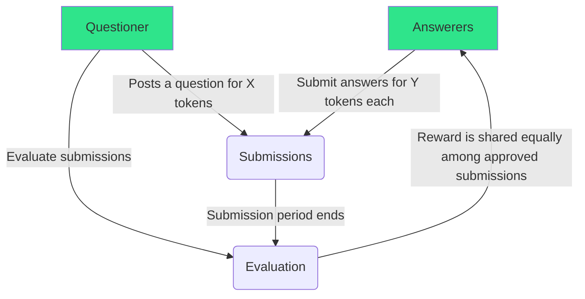

# Smarty Pants: Visage toy smart contract

Crowdsourced question answering with a DApp. The project was built using [the Truffle framework](https://truffleframework.com/).

## Description

With Smarty Pants questioners can post questions for a fixed amount of tokens. Posted questions are published on a web interface. Anyone can submit an answer paying a submission fee. After a certain period of time submissions are closed and the questioner approves answers he deems relevant. If the questioner doesn't approve any question

## Development

The solidity files have to be compiled with `truffle compile`, then migrated to the local blockchain with `truffle migrate`. The local blockchain can easily be run with [Ganache](https://truffleframework.com/ganache), that also offers a GUI to visualize transactions.

### Debugging

To interact with the compiled smart contract directly run `truffle develop`, this will display a prompt `truffle(develop)>`. Type `migrate`, then interact directly with the smart contract. For instance you can

- post a new question `QuestionPosting.deployed().then(function(instance){return instance.postQuestion("What is Visage?");})`
- check the question content in the blockchain `QuestionPosting.deployed().then(function(instance){return instance.getQuestion.call();})`

Check [this excellent tutorial](https://truffleframework.com/tutorials/debugging-a-smart-contract) for more information on debug with Truffle.

### Testing

Once the local blockchain is running and the smart contract was migrated to it, `truffle test` runs the tests suite.

### Browser interaction with the smart contract

To try the web interface and be able to interact with the smart contract:

1. Install [Metamask](https://metamask.io/)
2. If you are already logged in, log out and select the "Main Ethereum Network" if it is not already the case.  Login using "Import using account seed phrase"
3. Copy the Mnemonic from Ganach
4. Change the network to "Custom RPC" then enter `http://127.0.0.1:7545` in the box titled "New RPC URL" and click **Save**.

At this point MetaMask should point to the local blockchain and the right user.

## TODO

- [x] Create a web interface
- [ ] Add multiple questions support
- [ ] Implement a dispute resolution mechanism